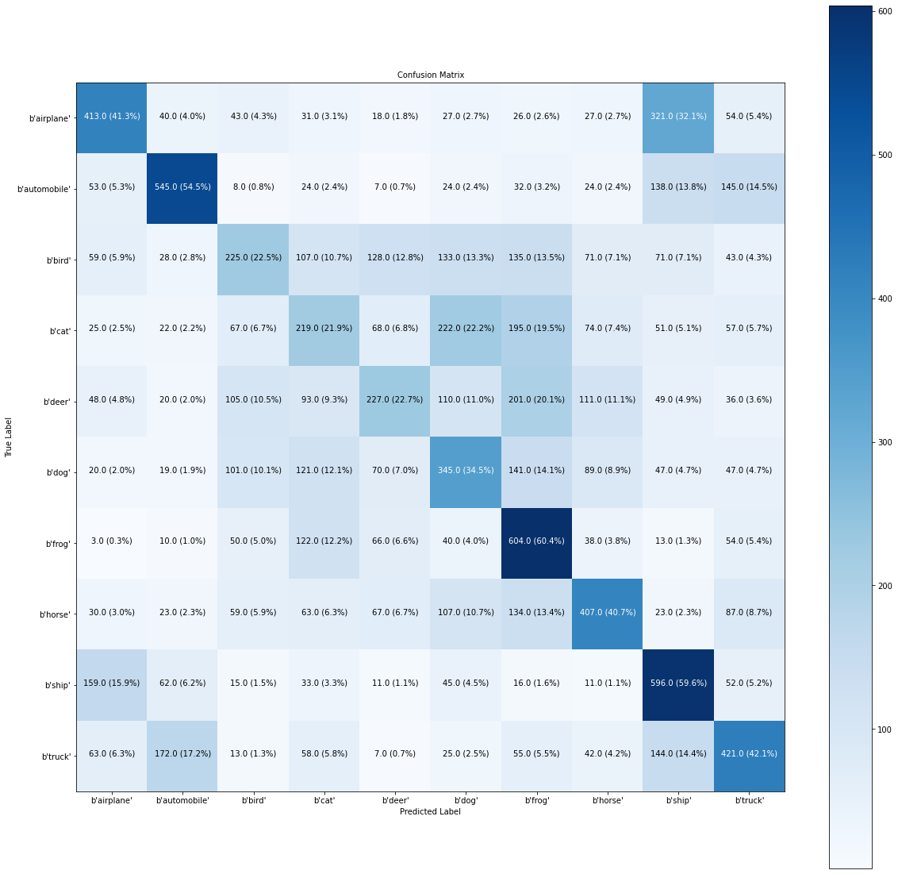

# CIFAR10 Classification from Scratch with Custom CNN Functions in PyTorch
 Implementation of Custom CNN for Training a Classifier on CIFAR10

## Confusion Matrix

Note: This work was done during Jan-Apr 2022 as a part of MS(R) thesis work under Prof. Gaurav Sharma
